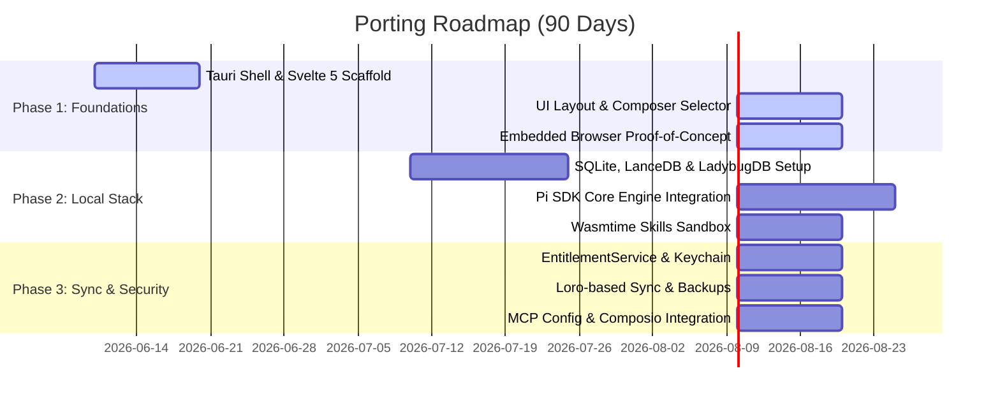

# Technical Specification: Porting Ask Dexter to macOS Native, Local-First Tauri Desktop Application

## 1. Executive Summary

This document specifies the technical architecture, design system references, implementation decisions, security models, and roadmap for porting **Ask Dexter** from a Next.js web application to a macOS-native, local-first, offline-capable desktop application.

### Core Philosophy
* **Local-First by Default**: Data storage, vector embeddings, graph relationships, and LLM orchestration must reside entirely on the local device. The application must remain fully functional without an internet connection.
* **Opt-In Cloud Sync**: Cloud connectivity is an opt-in utility for remote backups or device synchronization, never a blocker for core app operation.
* **Tauri over Electron**: To minimize resource overhead, memory consumption, and bundle size, the app will use **Tauri v2** with a Rust-based system layer and a lightweight reactive web frontend, rejecting Electron.

### High-Level Architecture
```
┌────────────────────────────────────────────────────────────────────────┐
│                        macOS native webview (WKWebView)                 │
│              Svelte 5 UI Engine + Zustand/Loro Client State            │
└───────────────────▲────────────────────────────────▲───────────────────┘
                    │                                │
            Tauri IPC Commands (RPC)          SSE Event Streams (Streaming)
                    │                                │
┌───────────────────▼────────────────────────────────▼───────────────────┐
│                          Tauri Rust Backend                            │
│ ┌────────────────────────┐  ┌─────────────────────┐  ┌───────────────┐ │
│ │  EntitlementService    │  │   SyncEngine (Loro) │  │  Local DB     │ │
│ │  (JWT Validation,      │  │   (conflict-free    │  │  (rusqlite +  │ │
│ │  Keychain integration) │  │   SQLite sync)      │  │  sqlite-vec)  │ │
│ └────────────────────────┘  └─────────────────────┘  └───────────────┘ │
│                                                                        │
│ ┌────────────────────────┐  ┌─────────────────────┐  ┌───────────────┐ │
│ │   Skills Sandbox       │  │  MCP Client Router  │  │  Pi SDK Core  │ │
│ │   (Wasmtime Engine)    │  │  (stdio / HTTP)     │  │  (Llama.cpp)  │ │
│ └────────────────────────┘  └─────────────────────┘  └───────────────┘ │
└───────────────────────────────────▲────────────────────────────────────┘
                                    │
                       FastAPI Server / Sidecar Process
                                    │
┌───────────────────────────────────▼────────────────────────────────────┐
│                    Local Inference Engine (Cortex.cpp)                 │
│      Model GGUF Files | Metal-accelerated Llama.cpp | localhost:1337   │
└────────────────────────────────────────────────────────────────────────┘
```

---

## 2. Reference Repository Analysis

We synthesize architectural mechanics and design patterns from four leading open-source local-first AI workspaces:

### A. Project Structural Breakdown
* **janhq/jan**: Uses a multi-process architecture with a Tauri/Electron shell hosting a Rust/TypeScript extension system, communicating via custom plugins to a C++ sidecar (`Cortex.cpp` / `llama.cpp`) running on `localhost:1337`.
* **pewdiepie-archdaemon/odysseus**: Operates as a docker-compose web PWA. It leverages FastAPI + SQLAlchemy with SQLite, ChromaDB as a separate vector container, and SearXNG for web search.
* **openyak/openyak**: Utilizes Tauri v2 to wrap a Next.js 15 frontend, communicating with a Python/FastAPI backend and utilizing SQLite in WAL mode.
* **rowboatlabs/rowboat**: Monorepo split between Electron desktop renderer, Next.js web dashboard, and shared packages (`packages/core` and `packages/shared`).

### B. Feature Parity & Gap Analysis (Odysseus vs. Target App)

| Feature Category | Odysseus Implementation | Target Tauri App Specification | Architectural Gap / Action Required |
| :--- | :--- | :--- | :--- |
| **Desktop Integration** | Self-hosted Web PWA (Docker) | Native macOS Tauri App | Port Docker dependencies to native Rust crates; replace web wrapper with Tauri OS API hooks. |
| **Inference Integration** | Ollama / llama.cpp / Cloud APIs | Local Cortex.cpp Sidecar + Cloud Models | Integrate a local sidecar model manager; implement automated macOS hardware/unified VRAM detection. |
| **Relational Storage** | SQLite (Docker Volume mount) | Embedded SQLite (`rusqlite`) | Implement local SQLite DB inside macOS `Application Support` with WAL enabled. |
| **Vector Storage** | ChromaDB (Docker Service) | Embedded Vector Store (`sqlite-vec` or `LanceDB`) | Replace ChromaDB with an in-process, disk-based vector storage system for zero setup overhead. |
| **Knowledge Graph** | None (Flat Vector + Markdown Files) | Property Graph (`LadybugDB` or SQLite schema) | Add entities, relations, and recursive GraphRAG traversal schemas. |
| **Client-Side Sync** | None (User-managed volume sync) | Multi-device CRDT-based Sync (`Loro`) | Build client-to-cloud conflict-free sync layers in Rust. |
| **Browser Integration** | None (Relies on server-side scraping) | CDP-based Headless Browser Automation | Implement CDP automation client for agent scraping tasks without bundling heavy browser engines. |
| **Capabilities Sandbox** | Raw Shell Access (Unsafe) | Sandboxed WASM/Wasmtime Skills Engine | Build a secure capability-restricted script execution runtime. |

### C. Rowboat UI Anti-Patterns to Avoid
1. **Unshared UI Duplication**: Rowboat contains three separate frontend apps that recreate components. We enforce a strict shared UI layer.
2. **Prop-Drilling & Context Abuse**: Global state is passed down manually or through heavy React Context, causing double renders. We use Zustand for atomic state updates.
3. **No Virtualization in Chat**: Long chat threads crash or stutter because the entire DOM is rendered. We mandate virtualization for the message container.
4. **Desktop-First Retrofitted for Mobile**: Spacing uses ad-hoc Tailwind classes (`p-2`, `p-3`) without a design token system. We enforce a 4px-grid spacing system.
5. **No Accessibility Outlines**: Focus states are stripped via `outline-none` with no keyboard fallback. We mandate accessible keyboard-focus rings.

---

## 3. Architecture Decision Records (ADRs)

### ADR-001: Frontend Framework Choice
* **Status**: Approved
* **Context**: The desktop shell must run inside Tauri's WKWebView. Memory usage, production bundle size, and rendering overhead directly determine cold-start times and overall responsiveness.
* **Decision**: We select **Svelte 5** (Runes) as the primary frontend framework.
* **Rationale**:
  * **Bundle Size**: Svelte 5 compiles to minimal JS (~8-10 KB gzipped) vs. React (~45 KB).
  * **Runtime Memory**: Svelte eliminates the Virtual DOM. Components are compiled to direct, fine-grained DOM manipulations, keeping frontend memory usage under 30MB.
  * **AI Code Generation**: Svelte 5's signal-like runes (`$state`, `$derived`) are highly structured, reducing LLM code-generation errors compared to React hooks (which suffer from stale closure bugs).

---

### ADR-002: Local Vector Store Selection
* **Status**: Approved
* **Context**: RAG tasks require semantic chunk matching. The vector store must run embedded in Rust, support macOS ARM64 SIMD hardware acceleration, and require zero setup from the user.
* **Decision**: We select **LanceDB** via the native Rust `lancedb` crate.
* **Rationale**:
  * **Rust Integration**: Native `lancedb` crate operates directly within the Tauri binary without requiring a separate server process.
  * **SIMD & GPU Acceleration**: On Apple Silicon, LanceDB leverages Metal (MPS) for training indexes, showing 15-20x speedup over CPU-only vector computations.
  * **Disk-Based Storage**: Unlike memory-locked vector databases, LanceDB stores data on disk (columnar format) and utilizes zero-copy reads, maintaining a tiny memory footprint.
  * **Milvus Lite Exclusion**: Milvus Lite has no Rust SDK, making it unusable in our Tauri backend.

---

### ADR-003: Knowledge Graph Technology
* **Status**: Approved
* **Context**: For entity extraction and GraphRAG operations, we require a property graph database. KùzuDB was archived in late 2025.
* **Decision**: We use **LadybugDB** (the active community fork of KùzuDB) via the `lbug` Rust crate. If maturity risks emerge, we fall back to a custom schema in our primary **SQLite** database using recursive CTEs.
* **Rationale**:
  * **Graph Traversals**: LadybugDB is an embedded columnar graph DB written in C++ with Rust bindings, utilizing index-free adjacency.
  * **Cypher Support**: Provides query syntax using openCypher, making graph traversals simple.
  * **SQLite Fallback**: Standard SQLite handles graph structures via self-referential tables and recursive CTEs for up to 3 hops without significant performance degradation.

---

### ADR-004: Embedded Browser Strategy
* **Status**: Approved
* **Context**: For agent search, scraping, and user-initiated web automation, the agent requires a browser interface. Bundling Chromium Embedded Framework (CEF) adds 200MB+ to the binary and complicates macOS signing.
* **Decision**: We use **CDP (Chrome DevTools Protocol)** via the Rust `chromiumoxide` crate to connect to the user's existing Chrome browser, with **Obscura** (a lightweight Rust-native headless browser) as the offline fallback.
* **Rationale**:
  * **WKWebView Limitations**: The app's main window runs in WKWebView, but Apple restricts executing automated scripts or headless browser commands in it.
  * **Zero Bundle Overhead**: Connecting to an existing Chrome installation via CDP keeps the Tauri installer tiny (~15MB).
  * **DevTools Access**: CDP grants complete control over the DOM, network request interception, and screenshots.

---

### ADR-005: Sync & Client-Side Conflict Resolution
* **Status**: Approved
* **Context**: Multiple local-first instances (e.g., Mac, iPad) must sync state. Conflicts must resolve deterministically offline.
* **Decision**: We implement a **Hybrid Sync Strategy**: **Loro** (Rust-native CRDT engine) for knowledge base documents, and **Last-Write-Wins (LWW)** for application settings.
* **Rationale**:
  * **Loro**: Supports rich text editing, collaborative structures, and movable tree hierarchies natively in Rust.
  * **LWW**: Chat settings and basic UI states do not benefit from full operational log storage. For these, timestamp-based LWW is sufficient.
  * **Clock Rollback Prevention**: System time checks are run on boot. If the local system clock is altered, sync is halted until corrected.

---

### ADR-006: Offline-First Subscription & Entitlement Model
* **Status**: Approved
* **Context**: Subscriptions must be validated without constant internet check-ins.
* **Decision**: We use a Rust-based `EntitlementService` performing **offline JWT validation** with a compile-time embedded RSA public key.
* **Entitlement Gating Matrix**:
  * **Free Tier**: Cloud Models limited (100k tokens/mo via proxy); Local Model download blocked; BYOK blocked.
  * **Paid Subscription**: Cloud Models high quota; Local Model download blocked; BYOK unlocked (keys saved in macOS Keychain).
  * **One-Time Purchase**: Cloud Models N/A; Local Model download permanently unlocked; BYOK N/A.
* **Grace Period**: A 7-day grace period is allowed if the app is offline when subscription expires.

---

### ADR-007: Local Agent Runtime SDK
* **Status**: Approved
* **Context**: Complex developer tasks require non-destructive branching, history tracking, and context compaction.
* **Decision**: We integrate the **Pi SDK** (`@earendil-works/pi-coding-agent`) as our core execution harness.
* **Rationale**:
  * **Branching & Forking**: Pi SDK represents chat history as a tree. Sessions can branch at any node, allowing non-destructive backtracking.
  * **Context Compaction**: Uses proactive compaction algorithms to summarize historical turns, keeping prompts within the limit.
  * **Model Swapping**: Standardizes OpenAI-compatible inputs, allowing users to swap models (e.g., local llama.cpp to Claude Code) mid-session.

---

## 4. Local-First Data Model (ER Diagram)

This ASCII Entity-Relationship diagram represents the local SQLite schema managed by `rusqlite` / `prisma`.

```
+───────────────────────────+
│           User            │
│  - id: TEXT (PK)          │
│  - email: TEXT            │
│  - premium_tier: TEXT     │
│  - local_token_count: INT │◄────────┐
│  - last_sync: DATETIME    │         │
+─────────────┬─────────────+         │
              │                       │
              ├───────────────────────┼───────────────────────┐
              │ 1                     │ 1                     │ 1
              ▼ 0..*                  ▼ 0..*                  ▼ 0..*
+───────────────────────────+ +───────────────────────────+ +───────────────────────────+
│       Conversation        │ │       KnowledgeBase       │ │         McpServer         │
│  - id: TEXT (PK)          │ │  - id: TEXT (PK)          │ │  - id: TEXT (PK)          │
│  - user_id: TEXT (FK)     │ │  - user_id: TEXT (FK)     │ │  - user_id: TEXT (FK)     │
│  - title: TEXT            │ │  - name: TEXT             │ │  - name: TEXT             │
│  - model_id: TEXT         │ +─────────────┬─────────────+ │  - url: TEXT              │
+─────────────┬─────────────+               │               │  - transport: TEXT (stdio)│
              │                             │ 1             │  - config_json: TEXT      │
              │ 1                           ▼ 0..*          +───────────────────────────+
              ▼ 0..*                  +───────────────────────────+
+───────────────────────────+ │       KnowledgeFile       │
│          Message          │ │  - id: TEXT (PK)          │
│  - id: TEXT (PK)          │ │  - kb_id: TEXT (FK)       │
│  - conversation_id: (FK)  │ │  - file_path: TEXT        │
│  - parent_message_id: TEXT│ +─────────────┬─────────────+
│    (For Pi branching tree)│               │
│  - role: TEXT             │               │ 1
│  - content: TEXT          │               ▼ 0..*
+───────────────────────────+ +───────────────────────────+
                              │      KnowledgeChunk       │
                              │  - id: TEXT (PK)          │
                              │  - file_id: TEXT (FK)     │
                              │  - chunk_text: TEXT       │
                              │  - embedding_id: TEXT     │◄─── (Linked to LanceDB
                              +───────────────────────────+      vector table)
```

### Specialized Local Tables

```
+───────────────────────────+
│        UserSkill          │
│  - id: TEXT (PK)          │
│  - name: TEXT             │
│  - script_path: TEXT      │
│  - sandbox_type: TEXT     │
│  - permissions_json: TEXT │
+───────────────────────────+

+───────────────────────────+
│    EntitlementLease       │
│  - id: TEXT (PK)          │
│  - jwt_token: TEXT        │
│  - expires_at: DATETIME   │
│  - grace_until: DATETIME  │
│  - hardware_hash: TEXT    │
+───────────────────────────+
```

---

## 5. Component Architecture & State Flow

```
                     ┌───────────────────────────────┐
                     │       Tauri Main Window       │
                     │          (WKWebView)          │
                     └───────────────┬───────────────┘
                                     │
             ┌───────────────────────┴───────────────────────┐
             ▼                                               ▼
┌───────────────────────────────┐               ┌───────────────────────────────┐
│     Sidebar Component         │               │     Main Workspace Area       │
│  - Thread List                │               │  - Split Panel Controller    │
│  - Model Selector             │               └───────────────┬───────────────┘
│  - Active Project Dropdown    │                               │
└───────────────────────────────┘             ┌─────────────────┴─────────────────┐
                                              ▼                                   ▼
                               ┌─────────────────────────────┐     ┌─────────────────────────────┐
                               │       Chat Composer         │     │       Artifact Panel        │
                               │  - Editor Area              │     │  - Rich Text renderers      │
                               │  - Workspace Selector Bar   │     │  - Code editor (monaco)     │
                               │    - Target Directory       │     │  - Skills Manager UI        │
                               │    - Execution Target       │     │  - MCP Settings View        │
                               │    - Active Git Branch      │     └─────────────────────────────┘
                               └──────────────┬──────────────┘
                                              │
                                              ▼  (Tauri IPC Command: invoke("run_agent"))
                               ┌─────────────────────────────┐
                               │    Rust Backend Layer       │
                               │  - EntitlementService       │
                               │  - Pi SDK State Controller  │
                               │  - Wasmtime Sandbox Manager │
                               └─────────────────────────────┘
```

---

## 6. Risk Assessment

### R1: WKWebView Browser Rendering Differences
* **Risk**: Layout inconsistencies compared to Chrome/Electron.
* **Mitigation**: Standardize on Tailwind CSS flexbox layout. Do not write nested CSS layouts exceeding three flexbox containers. Use WebKit-specific vendor prefixes for scrollbars and animations.

### R2: Local Inference Resource Exhaustion (Memory Pressure)
* **Risk**: Loading massive GGUF models on low-RAM systems causing system freeze.
* **Mitigation**: Rust checks total memory (via `sysinfo`) and unified VRAM before starting model loads. Hard-block model loading if VRAM is less than 6GB. Default to CPU threads dynamically if unified memory is overallocated.

### R3: JWT Tampering & Clock Rollback
* **Risk**: User changes system time to bypass offline grace periods or subscription end dates.
* **Mitigation**: Store a secure execution log timestamp in the macOS Keychain using the `security-framework` crate. Validate that `SystemTime::now()` is greater than the last recorded execution timestamp. If clock rollback is detected, lock cloud features immediately.

### R4: Local Code Execution Safety in Skills
* **Risk**: User-imported or AI-generated scripts deleting directories or executing shell exploits on the host OS.
* **Mitigation**: Execute user scripts inside a capability-isolated **Wasmtime Sandbox**. Deny file system and network access by default. Expose only limited, safe system APIs (e.g. read/write to active workspace root folder).

### R5: Context Window Degradation in Long Tasks
* **Risk**: Horizontal agent developer tasks exceeding context length, leading to memory loss or halucination.
* **Mitigation**: Apply the Pi SDK proactive compaction algorithm. Condense past conversation history into compact structured logs, keeping active prompt buffers below 40% of the total context window.

### R6: Sync Failures & Database Corruption
* **Risk**: Hard shut down corrupting SQLite file or resulting in sync state mismatch.
* **Mitigation**: Enable SQLite WAL mode. Perform sync mutations using Loro CRDT operations wrapped in transactional SQLite states. Store backups inside `Application Support/AskDexter/backups`.

### R7: Keychain Permission Popups
* **Risk**: macOS prompting authorization alerts to the user during background keychain read/writes.
* **Mitigation**: Set clear access control labels in `security-framework`. Store only static user credentials (API keys) in Keychain, keeping non-sensitive metadata in the SQLite DB.

---

## 7. Dependency Inventory

### Rust Crates (`Cargo.toml`)
* `tauri = { version = "2.11.2", features = ["all"] }`
* `tauri-plugin-store = "2.4.2"`
* `tauri-plugin-sql = "2.4.0"`
* `tauri-plugin-shell = "2.3.5"`
* `tauri-plugin-fs = "2.0.0"`
* `tauri-plugin-dialog = "2.7.1"`
* `tauri-plugin-notification = "2.3.3"`
* `rusqlite = { version = "0.40.0", features = ["bundled"] }`
* `lancedb = "0.15.0"` (Metal vector search support)
* `lbug = "0.2.1"` (LadybugDB property graph client)
* `security-framework = "3.7.0"` (macOS Keychain bindings)
* `wasmtime = "45.0.1"` (Sandboxed execution)
* `loro = "1.12.1"` (Conflict resolution CRDT)
* `jsonwebtoken = { version = "10.4.0", features = ["aws_lc_rs"] }`
* `chromiumoxide = "0.8.0"` (CDP client)
* `sysinfo = "0.39.3"` (VRAM/RAM detection)

### npm Packages (`package.json`)
* `svelte = "^5.0.0"`
* `zustand = "^5.0.14"`
* `@earendil-works/pi-coding-agent = "^1.2.0"`
* `@modelcontextprotocol/sdk = "^1.0.1"`
* `monaco-editor = "^0.52.0"`
* `lucide-svelte = "^1.17.0"`

---

## 8. Phase-by-Phase Technical Instructions

### Phase 1: Reference Repo Analysis & Styling Setup
* Extract layout variables from Jan and map design tokens to Svelte CSS properties.
* Construct the split-pane workspace (Chat on the left, Artifacts on the right) with a maximum of three nested flexbox containers.
* Configure custom focus outlines and screen-reader `aria-label` tags for all action components.

### Phase 2: Embedded Database & Local Storage Stack
* Configure `rusqlite` with Write-Ahead Logging (WAL) enabled.
* Set up LanceDB with an IVF-PQ index on vector data columns.
* Write recursive CTE SQLite helpers to fetch three-hop graph relationships from graph-linked columns, acting as the fallback for LadybugDB.

### Phase 3: Offline Entitlements & macOS Keychain
* Write `EntitlementService` in Rust.
* Embed the server's public RSA key into the binary via `include_bytes!`.
* Implement the clock rollback verification handler running on Tauri app start.

### Phase 4: Local Runtime, Skills, & MCP Panel
* Embed the `Wasmtime` engine to execute custom javascript tools compiled to WASM.
* Build the double-pane MCP Configuration Panel in Svelte, interfacing with local stdio servers.
* Implement the bottom-anchored workspace selector bar inside the chat composer.

### Phase 5: Cloud Sync & macOS Packaging
* Write the sync coordinator in Rust, using `Loro` to serialize local doc edits.
* Integrate Composio remote MCP servers using authentication hooks.
* Package using `cargo tauri build` and generate Apple Developer Code Signing and Notarization records.

---

## 9. 90-Day Implementation Roadmap


